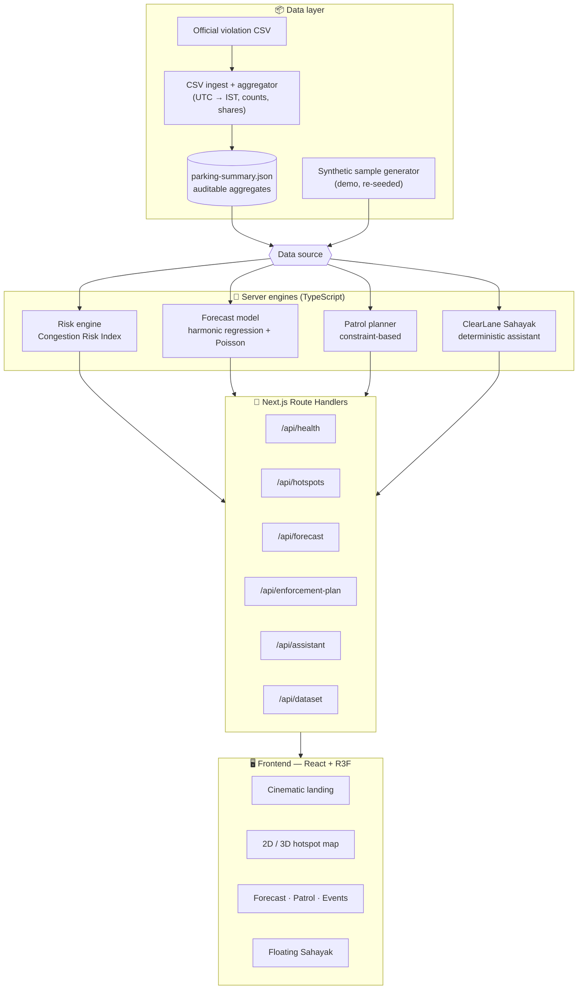
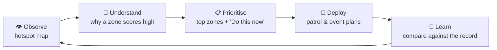
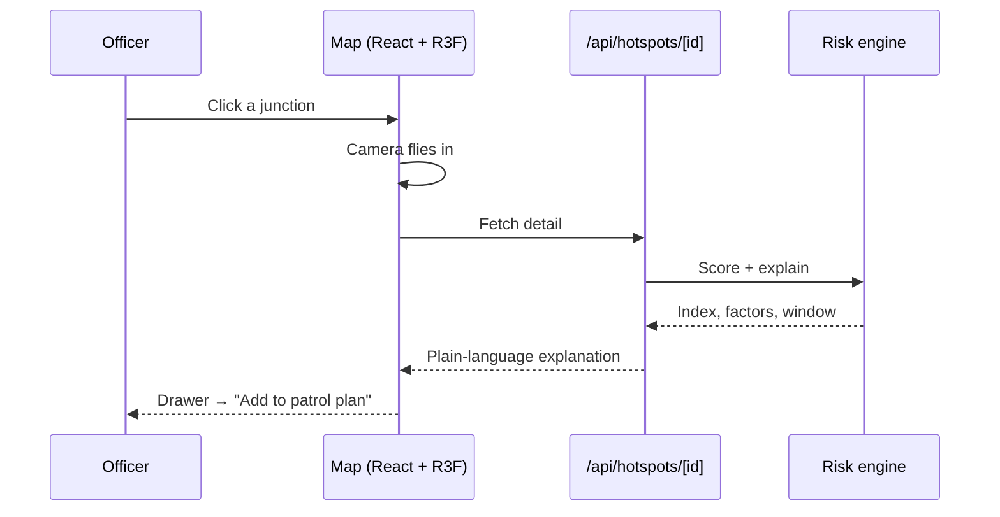
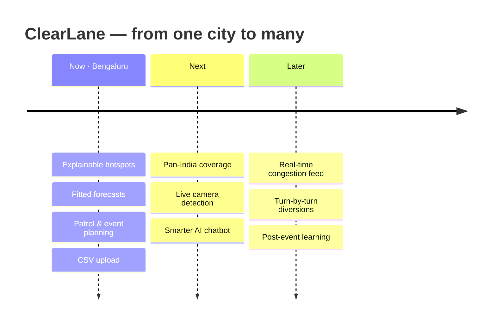
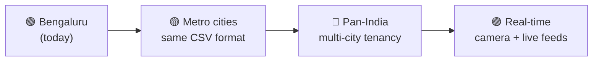

<div align="center">

# 🚦 ClearLane Bengaluru

### Clear the lane. Move the city.

**An evidence-led parking-congestion command centre that turns raw violation data into decisions an officer can act on — which junctions, in what order, and exactly when.**

[](https://tinyurl.com/ClearLane)

### 🔗 Try it live → [tinyurl.com/ClearLane](https://tinyurl.com/ClearLane)

[](https://nextjs.org/)
[](https://react.dev/)
[](https://www.typescriptlang.org/)
[](https://tailwindcss.com/)
[](https://r3f.docs.pmnd.rs/)


</div>

> Built for **Flipkart Gridlock Hackathon 2.0**. ClearLane is an independent decision-support tool — **not an official government service**. It uses only the supplied, anonymised violation dataset; there are **no live CCTV, traffic-speed, or travel-time feeds**.

---

## The problem, in human terms

One scooter on a footpath. One cab stopped on a main road near a junction. The bus can't pull in, autos spill into the lane, and the green light clears nothing. Multiply that across a city and you get gridlock — but enforcement today is reactive, and there's no clear picture of *where* parking actually chokes traffic, or *when*.

ClearLane reads the city's own violation record and answers four questions the brief asks:

> **Find the hotspots → Measure the impact → Target enforcement → Plan for events.**

---

## Dataset foundation

Everything is computed from a single, auditable source — no invented locations, capacities, occupancy or travel times.

| What | Value |
| --- | --- |
| Supplied violation records | **298,450** |
| Police stations | **54** |
| Named junctions | **168** |
| Window | **Nov 2023 → Apr 2024** |

Every number on screen is tagged as **observed** (straight from the data), **calculated** (worked out by an engine), or **forecast** (projected) — so you always know what you're looking at.

---

## 🏗️ Architecture



---

## 🔄 How it works — the operator loop

ClearLane is built around how a control room actually thinks, not around dashboards for their own sake.



And here's what happens the moment you click a junction:



---

## ✨ Features

- **Cinematic 3D landing** — a Bengaluru-inspired city model with traffic-data trails and motion controls.
- **Real OpenStreetMap hotspot map** with a violation **heatmap**, plus a 3D view — click a junction, it flies in, and a drawer explains it.
- **Explainable Parking-Induced Congestion Risk Index** — a 0–100 score you can fully inspect.
- **Validated forecast model** — harmonic (Fourier) regression + weekday seasonality + Poisson intervals, reported with **out-of-sample accuracy** from leave-one-hour-out cross-validation (no in-sample inflation).
- **Constraint-based patrol planner** — ranks junctions for a shift and splits them across units, time-ordered, and draws each unit's route on the map.
- **Event planning** — staffing, barricade and diversion suggestions for rallies, matches and festivals, with a suggested cordon ring on the map.
- **Voice dispatch (push-to-talk)** — speak the order to a unit aloud (radio squelch + notification + call-sheet log), or **record your own mic memo** and broadcast it; ready to plug into Zello / Motorola WAVE radios in production.
- **ClearLane Sahayak** — a deterministic, dataset-grounded assistant (never invents anything, never issues challans).
- **Bring your own data** — upload a CSV and the maps *and* the model rebuild automatically.

### The risk index, decoded

| Factor | Weight | Plain meaning |
| --- | --- | --- |
| Violation frequency | 30% | How many violations happen here vs. the busiest spot |
| Obstruction severity | 25% | Footpath / main-road / bus-stop parking counts as worse |
| Recurrence | 15% | Whether the problem keeps coming back |
| Junction proximity | 15% | How many other busy spots are within 1.5 km |
| Time-of-day concentration | 15% | How much it packs into a few peak hours |

> *"This index estimates parking-related congestion risk from violation patterns. It is **not** a direct measurement of traffic speed."*

---

## 🛰️ Dataset modes

ClearLane is a platform — it ships **disconnected**, on a clearly-labelled demo sample, and connects to real data in one click.

| Mode | What it is |
| --- | --- |
| `sample` | Synthetic demo data, re-seeded each session (the default) |
| `official-aggregates` | The real Bengaluru dataset, connected with one click |
| `uploaded` | Your own CSV — re-aggregated and re-modelled in-app |

---

## 🌏 Roadmap & future expansion

Today it's Bengaluru. The vision is every Indian city.





---

## 🧰 Tech stack

- **Next.js 16** (App Router) · **React 19** · **TypeScript**
- **Tailwind CSS v4** · **Framer Motion**
- **React Three Fiber** · **Three.js** · **Drei** for 3D
- **Zustand** for state · **Next.js Route Handlers** for the API
- A self-contained, dependency-free validation + ML layer (no paid LLM, no external model service)

---

## 🚀 Run locally

> 🌐 **Live demo:** [tinyurl.com/ClearLane](https://tinyurl.com/ClearLane) — no setup needed.

```bash
pnpm install
pnpm dev
```

Open [http://localhost:3000](http://localhost:3000).

### 🐳 Run with Docker (one command)

No Node or pnpm needed — just Docker:

```bash
docker compose up --build
```

…or with plain Docker:

```bash
docker build -t clearlane .
docker run -p 3000:3000 clearlane
```

Then open [http://localhost:3000](http://localhost:3000). The image uses Next.js
standalone output, so it stays small and starts fast.

### Verify

```bash
pnpm exec tsc --noEmit
pnpm build
```

### Rebuild local assets

```bash
pnpm models:generate
GRIDLOCK_PARKING_CSV=/absolute/path/to/dataset.csv pnpm data:build
```

---

## 🔌 API routes

| Method | Route | Purpose |
| --- | --- | --- |
| `GET` | `/api/health` | Service, dataset, metric and model status |
| `GET` `POST` `PUT` `DELETE` | `/api/dataset` | Inspect · upload CSV · connect Bengaluru · disconnect |
| `GET` | `/api/hotspots` | Filtered, paginated hotspot rankings |
| `GET` | `/api/hotspots/[id]` | Junction detail, factors & explanation |
| `GET` | `/api/forecast` | Next-shift model estimates with intervals |
| `POST` | `/api/enforcement-plan` | Generate a constrained patrol plan |
| `POST` | `/api/assistant` | Query ClearLane Sahayak |

---

## 🗂️ Project structure

```
clear-lane-bengaluru-dashboard/
├─ app/
│  ├─ page.tsx              # Cinematic landing
│  ├─ dashboard/            # Command centre
│  ├─ models/               # GLB asset lab (dev preview)
│  └─ api/                  # Route handlers
├─ components/              # Landing, dashboard, 3D, assistant, icons
├─ lib/
│  ├─ server/               # data-source, risk-engine, ml-model, planner, assistant, csv-ingest
│  ├─ api-client.ts         # typed browser fetchers
│  └─ store.ts              # Zustand store
├─ data/processed/          # auditable aggregates (+ provenance README)
└─ public/models/           # original GLB pack
```

---

## 🛡️ Responsible by design

ClearLane is honest about what it is — and isn't:

- It measures **recorded violations**, not vehicle speed, occupancy or travel time.
- It **never** issues challans and **never** touches personal or vehicle data (the dataset is anonymised and aggregated to the junction level).
- No claim of years of data, no fabricated "X% congestion reduction", no real-time CCTV.
- Forecasts are model **estimates** with intervals — clearly labelled, never guarantees. Accuracy is reported **out-of-sample** (leave-one-hour-out cross-validation), not the inflated in-sample fit.

---

## 👥 Team — Gitflix & Code

| Name | Contact |
| --- | --- |
| **Parth** | parthbandwal3@gmail.com |
| **Dinar** | dinarofficals@gmail.com |

<div align="center">

See [`data/README.md`](data/README.md) for data provenance and [`public/models/README.md`](public/models/README.md) for GLB details.

**ClearLane Bengaluru — clear the lane, move the city.**

</div>
